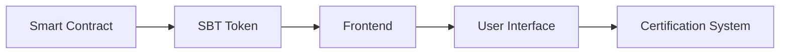

# 🎓 Build Your Own Certification System using Soulbound Tokens

<div align="center">


**An interactive blockchain development challenge for students**

[Start Challenge](#getting-started) · 
[View Demo](https://ks-certify-dapp.netlify.app/) · 
[Report Bug](https://github.com/thekalpstudio/issues) · 
[Request Feature](https://github.com/thekalpstudio/issues)

</div>

---
## Certify


## 🌟 Achievement Tracks

### 🏆 Beginner Track (0-400 points)
```
📚 Learn Blockchain Basics  [50 points]
🔧 Setup Development Environment [50 points]
🚀 Deploy First Smart Contract [100 points]
💎 Create Your First SBT [100 points]
🔍 Execute Basic Queries [100 points]
```

### 🎯 Intermediate Track (400-700 points)
```
🔄 Implement Advanced Contract Functions [100 points]
🎨 Build Basic Frontend [100 points]
🔌 Integrate Contract with Frontend [100 points]
```

### 👑 Advanced Track (700-1000 points)
```
🎮 Create Interactive UI [100 points]
📊 Implement Analytics Dashboard [100 points]
🌐 Deploy Full Production DApp [100 points]
```

## 🎯 Challenge Overview

Welcome to the Certify DApp Challenge! This hands-on tutorial will guide you through building a complete blockchain-based certification system. By the end, you'll have created a fully functional DApp that issues and manages Soulbound Tokens (SBTs) on the Kalp blockchain.

### What You'll Build



### Learning Outcomes
- 🔷 Master Soulbound Token implementation
- 🔷 Develop production-grade smart contracts
- 🔷 Build modern web frontends with Next.js
- 🔷 Integrate blockchain with web applications
- 🔷 Deploy full-stack DApps

## 🚀 Getting Started

### Prerequisites

| Tool | Version | Download |
|------|---------|----------|
| Go | >=1.19, <1.20 | [Download](https://go.dev/dl/) |
| Node.js | >=14.x | [Download](https://nodejs.org/) |
| npm | >=6.x | Included with Node.js |
| Postman | Latest | [Download](https://www.postman.com/downloads/) |
| Kalp Studio Account | - | [Sign Up](https://console.kalp.studio/) |

### 📦 Quick Start

1. **Clone Repository**
   ```bash
   git clone https://github.com/thekalpstudio/Certify.git
   cd certify
   ```

2. **Setup Smart Contract**
   ```bash
   cd sbtkalp
   go mod tidy
   ```

3. **Configure Frontend**
   ```bash
   cd ../certification
   npm install
   cp .env.example .env.local
   ```

## 💎 Challenge Modules

### Module 1: Smart Contract Development [300 points]

## 🎯 Learning Objectives
- Understand Soulbound Token (SBT) implementation
- Master Kalp SDK functionalities
- Learn blockchain state management
- Implement secure smart contract patterns

## 📋 Prerequisites [25 points]
- Install Go (>=1.19, <1.20)
- Set up GOPATH and workspace
- Basic understanding of blockchain concepts
- Familiarity with Go programming

## 🚀 Setup Environment [25 points]

1. Create project directory:
   ```bash
   mkdir sbtkalp
   cd sbtkalp
   ```

2. Initialize Go module:
   ```bash
   go mod init sbtkalp
   ```

3. Install Kalp SDK:
   ```bash
   go get -u github.com/p2eengineering/kalp-sdk-public/kalp
   ```

4. Initialize vendor directory:
   ```bash
   go mod vendor
   ```

## 💎 Core Contract Components [100 points]

### 1. Data Structures [25 points]
```go
// SBT Metadata structure
type SBTMetadata struct {
    Description  string `json:"description"`
    Name         string `json:"name,omitempty"`
    Organization string `json:"organization,omitempty"`
    DateOfIssue  string `json:"dateOfIssue,omitempty"`
}

// Main SBT structure
type SoulboundToken struct {
    Owner    string `json:"owner"`
    TokenID  string `json:"tokenID"`
    Metadata string `json:"metadata"`
}

// Smart Contract structure
type SmartContract struct {
    kalpsdk.Contract
}
```

### 2. State Management [25 points]
```go
// State prefixes for organization
const sbtPrefix = "soulboundToken"
const ownerMappingPrefix = "sbtOwnerMapping"

// Composite key creation example
compositeKey, err := sdk.CreateCompositeKey(sbtPrefix, []string{owner, tokenID})
```

### 3. Core Functions [50 points]

#### a. Initialize Contract [15 points]
Challenge Task: Implement the initialization function with the following requirements:
- Check if contract is already initialized
- Store metadata in JSON format
- Set contract state
- Handle errors appropriately

#### b. MintSBT Function [20 points]
Challenge Task: Implement token minting with these features:
- Generate unique TokenID using UUID
- Validate owner status
- Store token data
- Create composite keys

#### c. QuerySBT Function [15 points]
Challenge Task: Implement query functionality that:
- Retrieves token details
- Validates existence
- Returns formatted data

## 🎮 Implementation Challenges [150 points]

### Challenge 1: Implement Token Management [50 points]

#### Contract State Initialization
```go
func (s *SmartContract) Initialize(sdk kalpsdk.TransactionContextInterface, description string) error {
    // Your initialization code here
    // Hint: Use the provided metadata structure
}
```

Tasks:
- [ ] Check contract status
- [ ] Create metadata
- [ ] Store initialization flag
- [ ] Handle errors

#### Token Creation System
```go
func (s *SmartContract) MintSBT(sdk kalpsdk.TransactionContextInterface, address string) error {
    // Your minting code here
    // Hint: Use UUID for token generation
}
```

Tasks:
- [ ] Generate token ID
- [ ] Validate address
- [ ] Create token record
- [ ] Update state

### Challenge 2: Query System [50 points]

Implement these query functions:

1. Basic Token Query
```go
func (s *SmartContract) QuerySBT(sdk kalpsdk.TransactionContextInterface, owner string, tokenID string) (*SoulboundToken, error)
```

2. Owner-Based Query
```go
func (s *SmartContract) GetSBTByOwner(sdk kalpsdk.TransactionContextInterface, owner string) (*SoulboundToken, error)
```

3. Token Listing
```go
func (s *SmartContract) GetAllTokenIDs(sdk kalpsdk.TransactionContextInterface) ([]string, error)
```

### Challenge 3: Advanced Features [50 points]

1. Transfer Prevention System
```go
func (s *SmartContract) TransferSBT(sdk kalpsdk.TransactionContextInterface, from string, to string, tokenID string) error {
    // Implement transfer prevention
    // Hint: This should always return an error
}
```

2. Composite Key Management
```go
// Example composite key creation
mappingKey, err := sdk.CreateCompositeKey(ownerMappingPrefix, []string{address})
```

## 📝 Code Quality Guidelines [25 points]

1. Code Organization
   - Clean file structure
   - Consistent naming
   - Clear documentation

2. Error Handling
   - Descriptive messages
   - Proper propagation
   - Recovery handling

3. Documentation
   - Function comments
   - Usage examples
   - State management explanation

## 🏆 Success Criteria

To complete Module 1:

1. ✅ Implement all core functions
2. ✅ Pass provided test cases
3. ✅ Follow code guidelines
4. ✅ Document your code
5. ✅ Handle errors properly

## 📚 Resources

1. Development Tools:
   - [Kalp SDK Documentation](https://doc.kalp.studio/)
   - [Go Installation Guide](https://go.dev/doc/install)
   - [Kalp Studio Console](https://console.kalp.studio/)

2. Documentation:
   - [Smart Contract Guide](https://doc.kalp.studio/Dev-documentation/Kalp-DLT/Smart-Contract-Write-Test-Deploy-Interact/)
   - [API Reference](https://doc.kalp.studio/Getting-started/Kalp-API-Overview/)
   - [Deployment Guide](https://doc.kalp.studio/Dev-documentation/Kalp-DLT/Smart-Contract-Write-Test-Deploy-Interact/Deploy-the-smart-contract/)

## 🎯 Next Steps

After completion:
1. Review your implementation
2. Document your learnings
3. Prepare for Module 2
4. Share your achievements

Good luck with the challenge! 🚀


### Module 2: Frontend Integration [300 points]

```typescript
// Example: Mint New Token [100 points]
const mintSBT = async (recipientAddress: string) => {
  try {
    await fetch('https://gateway-api.kalp.studio/v1/contract/kalp/invoke/[CONTRACT_ID]/MintSBT', {
      method: 'POST',
      headers: {
        'Content-Type': 'application/json',
        'x-api-key': process.env.NEXT_PUBLIC_API_KEY!,
      },
      body: JSON.stringify({
        network: "TESTNET",
        blockchain: "KALP",
        walletAddress: "[YOUR_WALLET]",
        args: {
          address: recipientAddress
        }
      })
    });
  } catch (error) {
    console.error('Error minting SBT:', error);
  }
};
```

### Module 3: Deployment & Testing [400 points]

1. **Smart Contract Deployment** [150 points]
   - Follow [Deployment Guide](https://doc.kalp.studio/Dev-documentation/Kalp-DLT/Smart-Contract-Write-Test-Deploy-Interact/Deploy-the-smart-contract/)
   - Configure [Kalp Wallet](https://doc.kalp.studio/Getting-started/Configure-Kalp-wallet-in-Kalp-studio/)

2. **Frontend Deployment** [150 points]
   ```bash
   npm run build
   npm run dev
   ```

3. **Integration Testing** [100 points]
   - Complete [API Testing Guide](https://doc.kalp.studio/Getting-started/Kalp-API-Overview/)
   - Implement comprehensive test suite

 Example:🔒 Interact with Smart Contract Using Postman

Prerequisites:

After executing the above setup:

1. https://doc.kalp.studio/Getting-started/Onboarding/How-to-Sign-Up-and-Log-In-to-Kalp-Studio-Platform/

2. https://doc.kalp.studio/Dev-documentation/Kalp-DLT/Smart-Contract-Write-Test-Deploy-Interact/Deploy-the-smart-contract/

3. https://www.postman.com/downloads/


After deploying the smart contract in Kalp Studio, an API endpoint will be generated. This API endpoint can be used to interact with the deployed smart contract.

Here is an example of a generated API endpoint route in Kalp Studio:


Click on Check Params, and the routing details and parameters should look like this:


An API key is required for authorization in API POST requests.

It looks like this in Kalp Studio:


Setting Headers in Postman:
Set the required headers for authentication:

1. Key: x-api

2. Value: Paste the auth key you obtained after API key generation in Kalp Studio.


## 🌐 Required Resources

### Smart Contract Links
- [Kalp Studio Platform](https://console.kalp.studio/)
- [Sign Up Guide](https://doc.kalp.studio/Getting-started/Onboarding/How-to-Sign-Up-and-Log-In-to-Kalp-Studio-Platform/)
- [Wallet Configuration](https://doc.kalp.studio/Getting-started/Configure-Kalp-wallet-in-Kalp-studio/)
- [Contract Deployment](https://doc.kalp.studio/Dev-documentation/Kalp-DLT/Smart-Contract-Write-Test-Deploy-Interact/Deploy-the-smart-contract/)
- [Contract Interaction](https://doc.kalp.studio/Dev-documentation/Kalp-DLT/Smart-Contract-Write-Test-Deploy-Interact/Interact-with-smart-contract/)

### API Configuration
- Contract ID: `vHYQcRijQGB3UpVhqc3UeBM2D3ztjPuS1732534432325`
- Default Wallet: `ded665bca7d412891f44a571d908b66184b0ee10`
- [API Documentation](https://doc.kalp.studio/Getting-started/Kalp-API-Overview/)

## 🏆 Achievement Unlocking

### Beginner Achievements
- 🎯 Environment Wizard
- 🎯 Contract Master
- 🎯 Token Creator

### Intermediate Achievements
- 🎯 Frontend Pioneer
- 🎯 Integration Specialist
- 🎯 Testing Guru

### Advanced Achievements
- 🎯 DApp Architect
- 🎯 Production Master
- 🎯 Full Stack Developer

## 🆘 Support & Community

- [Developer Documentation](https://doc.kalp.studio/)
- [Community Forum](https://community.kalp.network/)
- [GitHub Issues](https://github.com/thekalpstudio/Certify/issues)
- [Troubleshooting Guide](https://doc.kalp.studio/Getting-started/Troubleshooting/)

## 📜 Certification Process

1. Complete all challenge modules
2. Submit your project for review
3. Pass the technical assessment
4. Receive your SBT certification
5. Join the Kalp Developer Community

## 🎮 Best Practices

- ✅ Follow Go programming conventions
- ✅ Write comprehensive tests
- ✅ Document your code
- ✅ Use proper error handling
- ✅ Implement security best practices

## 🔜 Next Steps

After completing this challenge:
1. Explore advanced Kalp features
2. Contribute to open source projects
3. Join the developer community
4. Build your own DApps

---

<div align="center">

**Happy Coding! 🚀**

[Get Started](#getting-started) | [Join Community](https://community.kalp.network/) | [View Documentation](https://doc.kalp.studio/)

</div>


## 📄 License

This project is licensed under the MIT License - see the [LICENSE](LICENSE) file for details.

