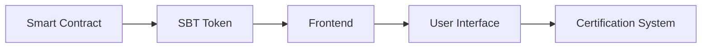

# 🎓 Build Your Own Certification System using Soulbound Tokens

<div align="center">


**An interactive blockchain development challenge for students**

[Start Challenge](#getting-started) · 
[View Demo](https://ks-certify-dapp.netlify.app/) · 
[Report Bug](https://github.com/thekalpstudio/issues) · 
[Request Feature](https://github.com/thekalpstudio/issues)

</div>

---
## Certify


## 🌟 Achievement Tracks

### 🏆 Beginner Track (0-400 points)
```
📚 Learn Blockchain Basics  [50 points]
🔧 Setup Development Environment [50 points]
🚀 Deploy First Smart Contract [100 points]
💎 Create Your First SBT [100 points]
🔍 Execute Basic Queries [100 points]
```

### 🎯 Intermediate Track (400-700 points)
```
🔄 Implement Advanced Contract Functions [100 points]
🎨 Build Basic Frontend [100 points]
🔌 Integrate Contract with Frontend [100 points]
```

### 👑 Advanced Track (700-1000 points)
```
🎮 Create Interactive UI [100 points]
📊 Implement Analytics Dashboard [100 points]
🌐 Deploy Full Production DApp [100 points]
```

## 🎯 Challenge Overview

Welcome to the Certify DApp Challenge! This hands-on tutorial will guide you through building a complete blockchain-based certification system. By the end, you'll have created a fully functional DApp that issues and manages Soulbound Tokens (SBTs) on the Kalp blockchain.

### What You'll Build



### Learning Outcomes
- 🔷 Master Soulbound Token implementation
- 🔷 Develop production-grade smart contracts
- 🔷 Build modern web frontends with Next.js
- 🔷 Integrate blockchain with web applications
- 🔷 Deploy full-stack DApps

## 🚀 Getting Started

### Prerequisites

| Tool | Version | Download |
|------|---------|----------|
| Go | >=1.19, <1.20 | [Download](https://go.dev/dl/) |
| Node.js | >=14.x | [Download](https://nodejs.org/) |
| npm | >=6.x | Included with Node.js |
| Postman | Latest | [Download](https://www.postman.com/downloads/) |
| Kalp Studio Account | - | [Sign Up](https://console.kalp.studio/) |

### 📦 Quick Start

1. **Clone Repository**
   ```bash
   git clone https://github.com/thekalpstudio/Certify.git
   cd certify
   ```

2. **Setup Smart Contract**
   ```bash
   cd sbtkalp
   go mod tidy
   ```

3. **Configure Frontend**
   ```bash
   cd ../certification
   npm install
   cp .env.example .env.local
   ```

## 💎 Challenge Modules

### Module 1: Smart Contract Development [300 points]

#### Core Functions
```go
// Initialize Contract [100 points]
func Initialize(sdk kalpsdk.TransactionContextInterface, metadata string) error

// Mint SBT Token [100 points]
func MintSBT(sdk kalpsdk.TransactionContextInterface, address string) error

// Query SBT Details [100 points]
func QuerySBT(sdk kalpsdk.TransactionContextInterface, owner string, tokenID string) (*SoulboundToken, error)
```

### Module 2: Frontend Integration [300 points]

```typescript
// Example: Mint New Token [100 points]
const mintSBT = async (recipientAddress: string) => {
  try {
    await fetch('https://gateway-api.kalp.studio/v1/contract/kalp/invoke/[CONTRACT_ID]/MintSBT', {
      method: 'POST',
      headers: {
        'Content-Type': 'application/json',
        'x-api-key': process.env.NEXT_PUBLIC_API_KEY!,
      },
      body: JSON.stringify({
        network: "TESTNET",
        blockchain: "KALP",
        walletAddress: "[YOUR_WALLET]",
        args: {
          address: recipientAddress
        }
      })
    });
  } catch (error) {
    console.error('Error minting SBT:', error);
  }
};
```

### Module 3: Deployment & Testing [400 points]

1. **Smart Contract Deployment** [150 points]
   - Follow [Deployment Guide](https://doc.kalp.studio/Dev-documentation/Kalp-DLT/Smart-Contract-Write-Test-Deploy-Interact/Deploy-the-smart-contract/)
   - Configure [Kalp Wallet](https://doc.kalp.studio/Getting-started/Configure-Kalp-wallet-in-Kalp-studio/)

2. **Frontend Deployment** [150 points]
   ```bash
   npm run build
   npm run dev
   ```

3. **Integration Testing** [100 points]
   - Complete [API Testing Guide](https://doc.kalp.studio/Getting-started/Kalp-API-Overview/)
   - Implement comprehensive test suite

## 🌐 Required Resources

### Smart Contract Links
- [Kalp Studio Platform](https://console.kalp.studio/)
- [Sign Up Guide](https://doc.kalp.studio/Getting-started/Onboarding/How-to-Sign-Up-and-Log-In-to-Kalp-Studio-Platform/)
- [Wallet Configuration](https://doc.kalp.studio/Getting-started/Configure-Kalp-wallet-in-Kalp-studio/)
- [Contract Deployment](https://doc.kalp.studio/Dev-documentation/Kalp-DLT/Smart-Contract-Write-Test-Deploy-Interact/Deploy-the-smart-contract/)
- [Contract Interaction](https://doc.kalp.studio/Dev-documentation/Kalp-DLT/Smart-Contract-Write-Test-Deploy-Interact/Interact-with-smart-contract/)

### API Configuration
- Contract ID: `vHYQcRijQGB3UpVhqc3UeBM2D3ztjPuS1732534432325`
- Default Wallet: `ded665bca7d412891f44a571d908b66184b0ee10`
- [API Documentation](https://doc.kalp.studio/Getting-started/Kalp-API-Overview/)

## 🏆 Achievement Unlocking

### Beginner Achievements
- 🎯 Environment Wizard
- 🎯 Contract Master
- 🎯 Token Creator

### Intermediate Achievements
- 🎯 Frontend Pioneer
- 🎯 Integration Specialist
- 🎯 Testing Guru

### Advanced Achievements
- 🎯 DApp Architect
- 🎯 Production Master
- 🎯 Full Stack Developer

## 🆘 Support & Community

- [Developer Documentation](https://doc.kalp.studio/)
- [Community Forum](https://community.kalp.network/)
- [GitHub Issues](https://github.com/thekalpstudio/Certify/issues)
- [Troubleshooting Guide](https://doc.kalp.studio/Getting-started/Troubleshooting/)

## 📜 Certification Process

1. Complete all challenge modules
2. Submit your project for review
3. Pass the technical assessment
4. Receive your SBT certification
5. Join the Kalp Developer Community

## 🎮 Best Practices

- ✅ Follow Go programming conventions
- ✅ Write comprehensive tests
- ✅ Document your code
- ✅ Use proper error handling
- ✅ Implement security best practices

## 🔜 Next Steps

After completing this challenge:
1. Explore advanced Kalp features
2. Contribute to open source projects
3. Join the developer community
4. Build your own DApps

---

<div align="center">

**Happy Coding! 🚀**

[Get Started](#getting-started) | [Join Community](https://community.kalp.network/) | [View Documentation](https://doc.kalp.studio/)

</div>


## 📄 License

This project is licensed under the MIT License - see the [LICENSE](LICENSE) file for details.

